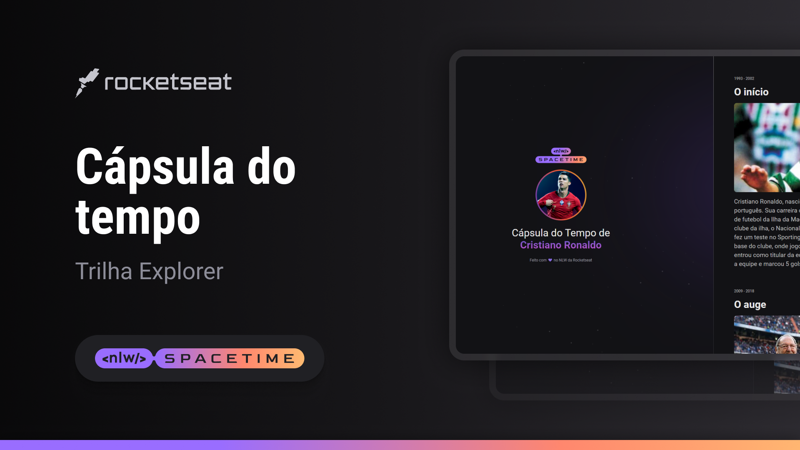

  

## 🖥️ Projeto
Esse é um projeto Web Responsivo de uma cápsula do tempo para exibir memórias em uma linha do tempo.

## 🚀 Tecnologias
Esse projeto foi desenvolvido durante o NLW da Rockeatseat com as seguintes tecnologias:

- HTML
- CSS
- Git e Github

## 🔖 Layout
Você pode visualizar o layout do projeto através
[desse link](https://www.figma.com/file/r0dm3qs2opPBZmVPaWgj49/Capsula-do-Tempo---NLW-Spacetime?type=design&node-id=306%3A3&t=POo0UDkSvAsI3WSi-1).
É necessário ter uma conta no [Figma](https://www.figma.com).